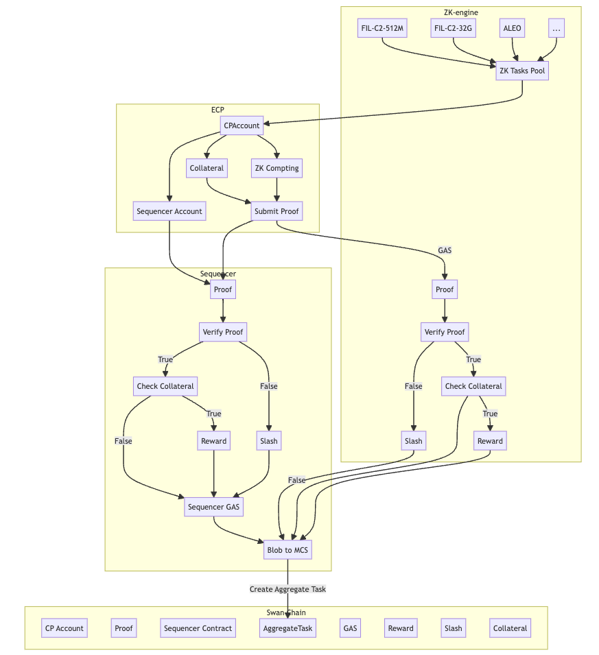

# ZK Engine

## Introduction
**ZK Engine** is a crucial component of the Swan Chain ecosystem, serving as the primary Market Provider (MP) for Zero-Knowledge (ZK) computations. One of its sub-components, the ZK Sequencer, plays a pivotal role in processing tasks and proofs.

## ZK Engine Component
### Functions

 - Task Collection and Assignment: The ZK Engine collects and assigns ZK tasks to appropriate CPs based on available resources.

 - Proof Validation and Settlement: It validates proofs submitted to the Swan Chain, handling the financial settlement, including rewards and penalties.

### ZK Sequencer

 - Proof Management: The Sequencer verifies and batches proofs into blobs, storing them in the Multi-Chain Storage (MCS) and creating unique identifiers (CIDs). This step minimizes gas costs for the network.

 - Collateral Management: It ensures CPs have sufficient collateral and handles batch settlement of tasks, including reward distribution, slashing, and gas payments.

 - Data Integrity: The Sequencer ensures the integrity of task data, checking for modifications and confirming the authenticity of proofs. It also manages the CID creation process and records it on the Swan Chain.

### Workflow

## Network and Version

| Item                    | Details                                                                 |
|-------------------------|-------------------------------------------------------------------------|
| Currency Symbol         | sETH                                                                    |
| Chain ID                | 254                                                                     |
| RPC URL                 | [https://mainnet-rpc01.swanchain.io](https://mainnet-rpc01.swanchain.io), [https://swanscan.io](https://swanscan.io) |
| Swan Credits Token Symbol | SWANC                                                                   |
| SwanETH Bridge          | [https://bridge.swanchain.io](https://bridge.swanchain.io)              |
| SWANC Claim Page        | [https://faucet.swanchain.io](https://faucet.swanchain.io)              |
| Block Explorer URL      | [https://mainnet-explorer.swanchain.io](https://mainnet-explorer.swanchain.io) |
| Swan Provider Dashboard | [https://orchestrator.swanchain.io/provider-status](https://orchestrator.swanchain.io/provider-status)|
| Swan Credits Token      | 0xAF90ac6428775E1Be06BAFA932c2d80119a7bd02                              |
| CP Account Register Contract | 0xbef1ec33e5Ac3a491fFeE1600e0b00eac97cb138                              |
| **ZK Task Register Contract** | 0x4Cd9b2450c3e412a1F0F0aE78C79271337241E31                              |                           
| **ECP Collateral Contract** | 0x0b84cc9CcE1459c85337b511872528cE947C3962                              |                             
| **ZK engine Publick Key**   | 0xB5aeb540B4895cd024c1625E146684940A849ED9                              |
| **ZK-engine reward address** | 0xC2EF272e14a7A222eA909bBB6C5ffdb9B2EFAC02                              |
| **Sequencer Contract**      | 0xE0a88F1fA56D8a8D73E9bb9Fc03506439cb386Bd                              |                            
| Collateral for ECP      | 100 SWANC/Period Tasks                                                  |
| Gas to Sequencer        | 0.00001 sETH/task                                                       |
| Sequencer Blob Period   | 24 Hours                                                                |

